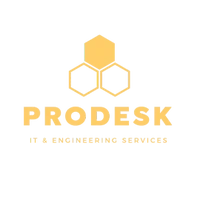

<div align="center">



# 🚀 Prodesk IT Internship

### Full-Stack MERN Engineering Journey
 


<br>


<br><br>
</div>

---


## 👨‍💻 About Me

**Daksh Choudhary**
B.Tech (Artificial Intelligence & Machine Learning) student passionate about Full-Stack MERN Development, Backend Engineering, REST API Design, Cloud Database Integration, and scalable Software Product Development.

Through this internship, I have progressed from frontend development to building and deploying complete MERN Stack applications with React, Node.js, Express.js, MongoDB Atlas, and modern deployment workflows.

* Responsive Web Design
* JavaScript Engineering
* React Development
* Backend Development with Node.js & Express
* REST API Design
* CRUD Operations
* Express Routing & Middleware
* Authentication Concepts
* API Integration
* State Management
* Browser Storage
* UI/UX Development
* Git & GitHub Workflow
* MERN Stack Development
* MongoDB Atlas
* Mongoose ODM
* Axios API Integration
* File Uploads (Multer)
* Cloud Deployment (Vercel)
* Environment Configuration
* API Testing

---

## 🏢 About the Internship

A project-based software engineering internship where every sprint focuses on solving real-world development challenges using modern frontend, backend, and full-stack technologies.

---

## 📊 Internship Statistics

| Metric | Value |
|--------|------:|
| 🚀 Sprint Projects | 12 |
| 💼 Client Deliveries | 3 |
| 🌐 Live Deployments | 15 |
| ⚛️ React Projects | 8 |
| 🔧 REST APIs | 3 |
| 🗄️ MongoDB Projects | 2 |
| ☁️ Vercel Deployments | 15 |
| 💻 Technologies Used | 15+ |

---

## 🎯 Internship Journey

Started with HTML, CSS, and JavaScript projects and progressively advanced through React development, REST API engineering, MongoDB integration, and full-stack MERN application development. Each sprint focused on solving real-world engineering problems while following production-oriented development practices.

---

## 📂 Repository Structure

---

```text
Internship-Sprints/
├── Client_Delivery_1/
├── Client_Delivery_2/
├── Client_Delivery_3/
├── Sprint_1/
├── Sprint_10/
├── Sprint_11/
├── Sprint_12/
├── Sprint_2/
├── Sprint_3/
├── Sprint_4/
├── Sprint_5/
├── Sprint_6/
├── Sprint_7/
├── Sprint_8/
├── Sprint_9/
├── .gitignore
├── README.md
└── logo.png
```

---

## 🏆 Sprint Projects

| Sprint | Project | Tech Stack | Live Demo |
|--------|---------|------------|-----------|
| Sprint 01 | Prodesk IT Landing Page | Responsive business landing page built with HTML, CSS, and JavaScript | [🌐 Live](https://internship-prodesk-it.vercel.app/) |
| Sprint 02 | Cash-Flow Dashboard | Financial management dashboard with expense tracking, charts, reports, and currency conversion | [🌐 Live](https://internship-prodesk-it-uldp.vercel.app/) |
| Sprint 03 | Weather-Cast | Real-time weather dashboard using Fetch API, Async/Await, WeatherAPI, Geolocation API, LocalStorage caching, dynamic weather icons, and responsive UI | [🌐 Live](https://internship-prodesk-it-gb4g.vercel.app/) |
| Sprint 04 | CoverCraft — AI Cover Letter Generator | AI-powered SaaS utility using Google Gemini API, prompt engineering, PDF resume parsing, secure localStorage key management, and glassmorphism UI | [🌐 Live](https://internship-prodesk-it-9831.vercel.app/) |
| Sprint 05 | TaskFlow — Kanban Task Board | React 19 + Vite Kanban board with drag-and-drop (@dnd-kit), task priorities, inline editing, global search, and LocalStorage persistence | [🌐 Live](https://internship-prodesk-it-k7fs.vercel.app/) |
| Sprint 06 | Aurora — React E-Commerce SPA | Modern React + Vite e-commerce application featuring React Router, Context API, dynamic product pages, global shopping cart, LocalStorage persistence, guest authentication, protected checkout, and responsive UI powered by the DummyJSON API. | [🌐 Live](https://internship-prodesk-it-tdeo.vercel.app/) |
| Sprint 07 | Vision — Multi-Step Onboarding Wizard| Developed a production-inspired multi-step onboarding wizard using React 19, Vite, React Hook Form, and Zod. Implemented real-time validation, reusable components, responsive design, password strength indicators, and a polished SaaS-style user experience following modern frontend development practices.| [🌐 Live](https://internship-prodesk-it-qdta.vercel.app/) |
| Sprint 08 | CineVerse AI — Netflix-Lite Movie Discovery Platform | Developed a production-inspired AI-powered movie discovery platform using React 19, Vite, TMDB API, and Google Gemini AI. Implemented real-time movie search with debouncing, AI mood-based recommendations, infinite scrolling, lazy loading, persistent favorites with Local Storage, responsive Netflix-inspired UI, and performance optimizations to deliver a seamless streaming-style user experience. | [🌐 Live](https://internship-prodesk-it-worl.vercel.app/)|
| Sprint 09 | The Data Hub — RESTful Blog API | Engineered a production-inspired RESTful Blog API using Node.js and Express.js. Implemented complete CRUD operations, modular MVC-inspired architecture, custom request logging middleware, mock JWT authentication, global error and 404 handling, health check endpoints, proper HTTP status codes, and API testing with Thunder Client, showcasing backend development best practices and scalable server-side architecture. | [🌐 Live API](https://internship-prodesk-it-ukpa-gvsv6whoi.vercel.app/) |
| Sprint 10 | The Data Hub v2 — Production Blog API with MongoDB | Engineered a production-ready RESTful Blog API using Node.js, Express.js, MongoDB Atlas, and Mongoose. Implemented persistent CRUD operations, modular MVC architecture, schema validation, environment-based configuration, centralized error handling, health check endpoints, and production deployment, demonstrating scalable backend development practices with cloud database integration. | [🌐 Live API](https://sprint10.vercel.app/) |
| Sprint 11 | The Data Hub v3 — Full Stack MERN Content Management System | Developed a production-inspired MERN Stack content management application integrating React 19, Vite, Node.js, Express.js, MongoDB Atlas, Mongoose, Axios, Multer, and Cloudinary/Local Uploads. Implemented full-stack CRUD operations, real-time API integration, image uploads with FormData, loading and error states, responsive SaaS-inspired UI, reusable React components, and seamless frontend-backend communication following modern full-stack engineering best practices. | [🌐 Live](https://sprint-11frontend.vercel.app/) |
| Sprint 12 | Ripple — Real-Time WebSocket Chat Application | Built a production-inspired real-time chat application using React 19, Vite, Node.js, Express.js, and Socket.IO. Implemented persistent WebSocket connections, bidirectional real-time messaging, username-based sessions, live typing indicators, room-based communication with isolated message broadcasting, automatic reconnection handling, responsive modern UI, and seamless frontend-backend integration following scalable real-time application architecture and WebSocket engineering best practices. | [🌐 Live](https://sprint-12.vercel.app/) |


---

## 💼 Client Delivery Projects

| Client Delivery | Project | Tech Stack | Live Demo |
|----------------|---------|------------|-----------|
| Client Delivery 01 | Food Truck Menu Management System – Digital menu management dashboard with automatic category icons, menu creation, search, category filtering, dashboard statistics, form validation, XSS sanitization, analytics simulation, and a fully responsive enterprise UI. | React, Vite, JavaScript, CSS | [🌐 Live](https://internship-prodesk-it-j54l-7ri1d2jvu.vercel.app/) |
| Client Delivery 02 | Developed a premium enterprise-style internal management dashboard for an independent photography studio. The project features booking management, client management, gallery administration, studio scheduling, payment overview, responsive layouts, accessibility, form validation, loading & empty states, theme switching, and XSS-safe input handling using pure HTML, CSS, and Vanilla JavaScript.. |HTML5 • CSS3 • JavaScript | [🌐 Live](https://internship-prodesk-it-w5mo.vercel.app/) |
| Client Delivery 03 | Game Waitlist CRUD API with Route Parameters – Developed a production-inspired backend REST API for managing gaming waitlists using Node.js and Express.js. Implemented complete CRUD operations, route parameters, modular architecture, request validation, XSS sanitization, analytics logging, proper HTTP status codes, middleware, and standardized JSON responses for enterprise-ready backend development. |Node.js • Express.js • REST API • Middleware • UUID • Helmet • Morgan | [🌐 Live](https://clientproject3.vercel.app/) |


---

## 🛠 Technology Stack

| Frontend | Backend | Database | Tools |
|:---------:|:-------:|:--------:|:-----:|
| <br><b>HTML5</b> | <br><b>Node.js</b> | <br><b>MongoDB</b> | <br><b>Git</b> |
| <br><b>CSS3</b> | <br><b>Express.js</b> | Mongoose | <br><b>GitHub</b> |
| <br><b>JavaScript</b> | REST API | <br><b>MySQL</b> | <br><b>VS Code</b> |
| <br><b>React</b> | Middleware | <br><b>Firebase</b> | <br><b>Linux</b> |
| <br><b>Vite</b> | <br><b>NPM</b> |  | <br><b>Vercel</b> |

---

### Developed by Daksh Choudhary 🚀

Full-Stack MERN Developer | Backend & Frontend Engineer | AI & ML Student
