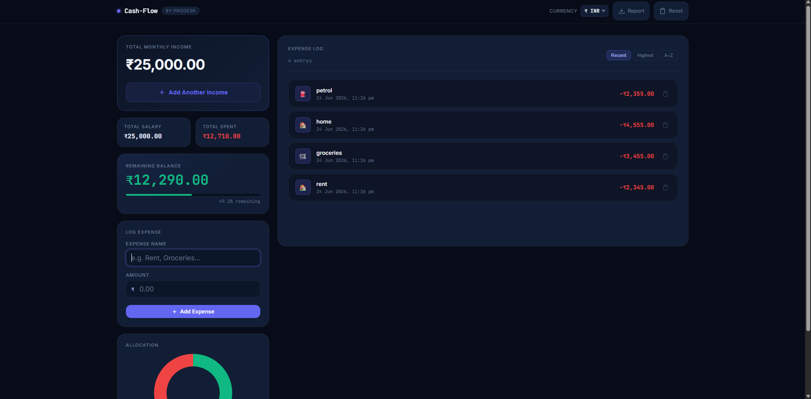
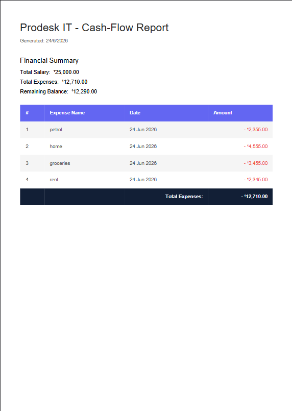
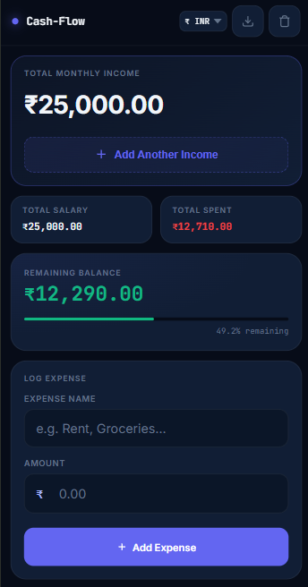
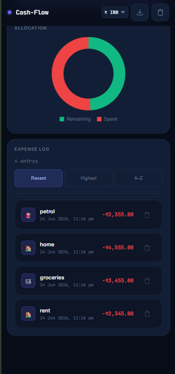

<p align="center">
  
</p>


<div align="center">

# 📊 Cash-Flow Dashboard

<p align="center">
  
  
  
  
</p>

<p align="center">
  <strong>A modern, responsive, and robust personal finance management web application.</strong>
</p>

</div>

<br />

## 📖 Overview

**Cash-Flow Dashboard** is a comprehensive, client-side personal finance management tool built to help users take control of their finances with ease. It features an intuitive, modern interface for tracking income and expenses, visualizing spending habits, and generating professional reports. With multi-currency support and local data persistence, it offers a secure and seamless experience directly in the browser, without the need for complex backend setups.

## ✨ Key Features

- **💰 Income & Expense Management**: Easily log, categorize, and track your financial transactions.
- **📈 Real-Time Balance**: Instantly view your current balance with automatic calculations.
- **🗑️ Expense Deletion**: Flexibly remove entries to keep your records accurate.
- **📊 Interactive Visualizations**: Gain deep insights into your spending patterns with dynamic `Chart.js` integration.
- **📄 PDF Reporting**: Export professional-grade financial reports in a single click using `jsPDF`.
- **💱 Multi-Currency Support**: Convert values on-the-fly between major currencies (INR, USD, EUR, GBP, JPY) using the Frankfurter API.
- **⚠️ Smart Alerts**: Get low balance threshold alerts to stay on top of your financial health.
- **💾 LocalStorage Persistence**: Your data stays securely on your device, persisting across sessions.
- **📱 Fully Responsive**: A flawless, app-like experience across desktop, tablet, and mobile devices.

---

## 📸 Screenshots

<details>
<summary><b>Click to expand and view screenshots</b></summary>
<br>

| Dashboard Overview | Interactive Analytics |
| :---: | :---: |
|  |  |

| Mobile View | Mobile View  |
| :---: | :---: |
|  |  |

</details>

---

## 🛠️ Tech Stack

- **Frontend Core**: HTML5, CSS3, Vanilla JavaScript (ES6+)
- **Data Visualization**: [Chart.js](https://www.chartjs.org/)
- **Document Generation**: [jsPDF](https://parall.ax/products/jspdf)
- **Data Persistence**: Web Storage API (LocalStorage)
- **External API**: [Frankfurter Exchange Rate API](https://www.frankfurter.app/)

---

## 🚀 Installation & Setup

Running the Cash-Flow Dashboard locally is incredibly simple as it requires no backend or build steps.

1. **Clone the repository**
   ```bash
   git clone https://github.com/dakshchoudhary8881-cmd/Internship_PRODESK_IT.git
   ```

2. **Navigate to the project directory**
   ```bash
   cd cash-flow-dashboard
   ```

3. **Open the application**
   Simply double-click the `index.html` file to open it in your preferred modern web browser.
   
   *Optional: For the best development experience, use a local server like VS Code's "Live Server" extension.*

---

## 📁 Folder Structure

```text
Sprint_2/
├── css/
│    └── style.css
├── Js/
│    └── script.js
├── assets/
│    └── images
│         └── desktop-view.png
│         └── logo.png
│         └── mobile-view-1.png
│         └── mobile-view-2.png
│         └── report.png
├── index.html       
└── README.md           
```

---

## Deployment

Deployed on Vercel: **[https://internship-prodesk-it.vercel.app/]**

---

## 👨‍💻 Author

**Daksh Choudhary**
- GitHub: [dakshchoudhary8881-cmd](https://github.com/dakshchoudhary8881-cmd)
- LinkedIn: [Daksh Choudhary](https://www.linkedin.com/in/daksh-choudhary-ba4786381/?lipi=urn%3Ali%3Apage%3Ad_flagship3_profile_view_base_contact_details%3BYffbcsa5S1m0903tqS%2BqaQ%3D%3D)

---

<p align="center">
  <i>Built for the Prodesk IT Sprint 02 internship task.</i>
</p>
