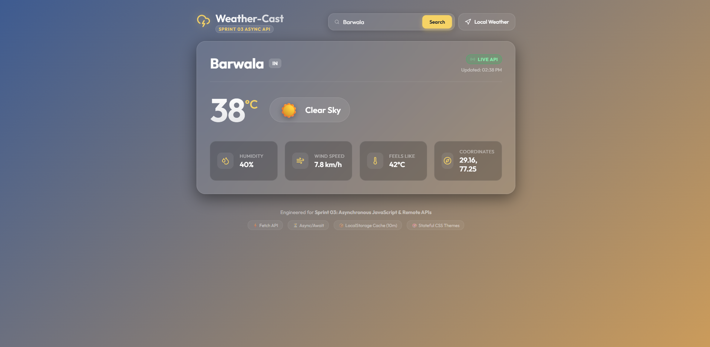
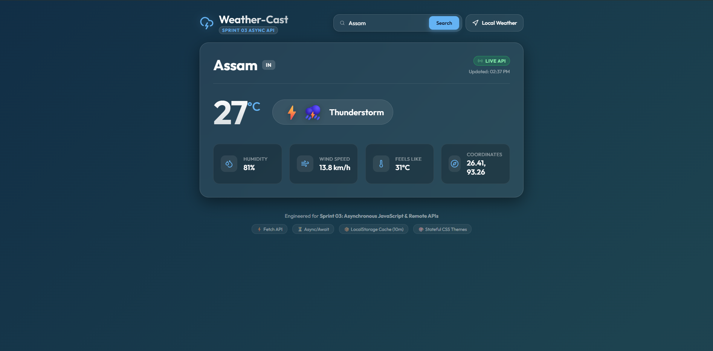

<p align="center">
  
</p>


<div align="center">

# 🌩️ Weather-Cast — Live Data Integration Module

<p align="center">
  
  
  
  
</p>

<p align="center">
  <strong>A modern, responsive, and robust atmospheric live weather monitoring web application.</strong>
</p>

</div>

<br />

## 📖 Overview
**Weather-Cast** is a comprehensive, client-side web application architected for Sprint 03 to master remote server communication and asynchronous data handling. Built without complex backend setups, it communicates directly with external weather APIs using modern Asynchronous JavaScript (`async/await`). The module requests, parses, and dynamically renders real-time atmospheric payloads while featuring intelligent client-side caching, GPS auto-discovery, and stateful visual theme transitions that adapt dynamically to the weather.

## ✨ Key Features
- **🌤️ Live Atmospheric Tracking**: Request, parse, and render real-time data points including Current Temperature, Weather Condition, Relative Humidity, Wind Speed, and Apparent Temperature.
- **🔍 Real-Time City Search**: Dynamically reconstruct API URLs on the fly to search and load live forecasts for any global city instantly.
- **📍 Native Geolocation**: Automatically request user coordinates on initial startup and reverse-geocode local atmospheric conditions without manual input.
- **📦 Smart 10-Minute Caching**: Built-in LocalStorage persistence engine that checks freshness before fetching, serving instant cached results (`📦 Cached (10m)`) to conserve network bandwidth.
- **🎨 Stateful CSS Themes**: Smoothly shift background gradients and ambient UI accents between Clear Skies, Rain Showers, Overcast Clouds, and Snowy themes based on live weather payloads.
- **⚠️ Graceful Error Degradation**: Comprehensive `try/catch` wrapping intercepts 404/invalid city requests and presents clean, user-friendly UI banners instead of breaking silently or crashing the console.
- **📱 Fully Responsive Glassmorphism**: A flawless, app-like frosted glass experience across desktop, tablet, and mobile devices.

---

## 📸 Screenshots
<details>
<summary><b>Click to expand and view application highlights</b></summary>
<br>

| Clear Sky Theme | Moody Rain Theme |
| :---: | :---: |
|  |  |
</details>

---

## 🛠️ Tech Stack
- **Frontend Core**: HTML5, CSS3, Vanilla JavaScript (ES6+)
- **Asynchronous Networking**: Native Fetch API (`async / await`)
- **Data Persistence**: Web Storage API (LocalStorage)
- **External REST APIs**: Open-Meteo Weather API, Open-Meteo Geocoding API, BigDataCloud Reverse Geocode API
- **Iconography & Fonts**: Lucide Icons CDN, Google Fonts (Outfit)

---

## 🚀 Installation & Setup
Running the Weather-Cast module locally is incredibly simple as it requires no backend configuration or build pipeline.

1. **Clone the repository**
   ```bash
   git clone https://github.com/dakshchoudhary8881-cmd/Internship_PRODESK_IT.git
   ```

2. **Navigate to the project directory**
   ```bash
   cd Internship-Sprints/Sprint_3
   ```

3. **Open the application**
   Simply double-click the `index.html` file to launch it directly in your preferred modern web browser.

---

## 📁 Folder Structure
```text
Sprint_3/
├── assets/
│    └── images/
│         └── logo.png
│         └── rainy.png
│         └── sunny.png
├── css/
│    └── style.css
├── js/
│    └── app.js
├── index.html       
└── README.md           
```

---

## 🌐 Deployment

Deployed on Vercel: https://internship-prodesk-it-gb4g.vercel.app/

---

## 👨‍💻 Author
**Daksh Choudhary**

- **GitHub**: [dakshchoudhary8881-cmd](https://github.com/dakshchoudhary8881-cmd)
- **LinkedIn**: [Daksh Choudhary](https://www.linkedin.com/in/daksh-choudhary-ba4786381/?lipi=urn%3Ali%3Apage%3Ad_flagship3_profile_view_base_contact_details%3BYffbcsa5S1m0903tqS%2BqaQ%3D%3D)

<p align="center">
 <i>Built for the Prodesk IT Sprint 03 internship task.</i>
</p>
