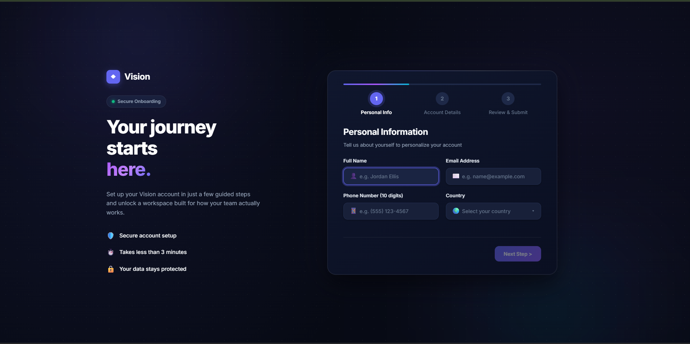
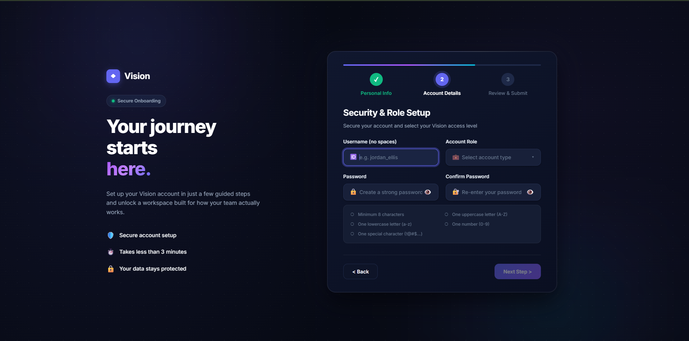
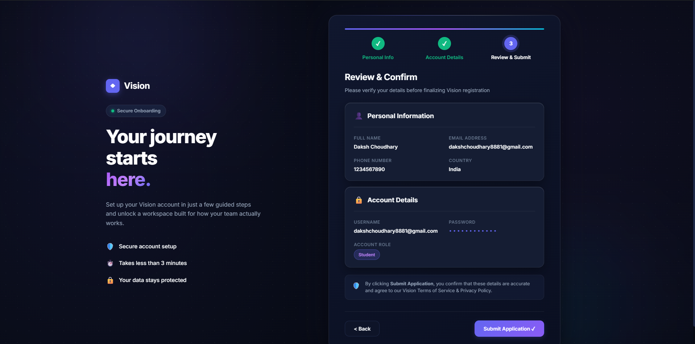
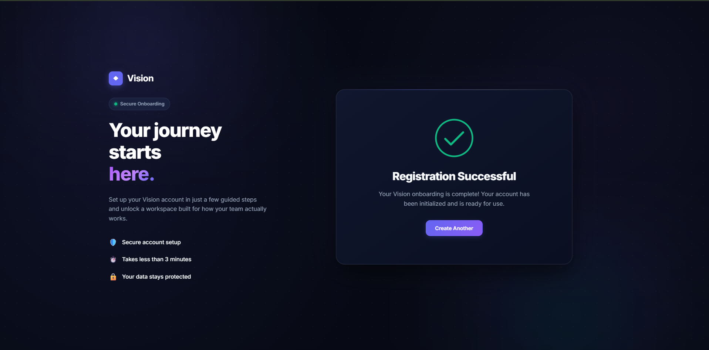

<div align="center">

# 🚀 Sprint 07 — Multi-Step Onboarding Wizard

A **production-inspired SaaS onboarding experience** built with **React 19**, **Vite**, **React Hook Form**, and **Zod**, featuring a responsive multi-step registration flow, real-time validation, reusable components, and modern UI animations.


### 🌐 Live Demo

**🔗 https://internship-prodesk-it-qdta.vercel.app/**

</div>

---

## 📸 Preview

> Replace these with your screenshots or GIFs.

| Step 1 | Step 2 |
|:-------:|:-------:|
|  |  |

| Review | Success |
|:-------:|:-------:|
|  |  |

---

## ✨ Features

- 🚀 Three-Step SaaS Onboarding Flow
- ✅ Real-Time Validation with React Hook Form & Zod
- 🔒 Password Strength Meter & Show/Hide Password
- 📊 Animated Progress Bar & Step Indicator
- 📋 Review Before Submission
- 🎉 Success Confirmation Screen
- 📱 Fully Responsive Design
- ♿ Accessible Form Components
- 🎨 Modern Glassmorphism UI
- ⚡ Reusable & Scalable Component Architecture

---

## 🛠 Tech Stack

| Frontend | Validation | Styling |
|----------|------------|----------|
| React 19 | React Hook Form | CSS3 |
| Vite | Zod | Responsive Design |
| JavaScript | @hookform/resolvers | Modern Animations |

---

## 📂 Project Structure

```text
src/
├── components/
├── hooks/
├── schemas/
├── styles/
├── utils/
├── App.jsx
└── main.jsx
```

---

## 🚀 Getting Started

```bash
git clone <repository-url>

cd Sprint_7

npm install

npm run dev
```

---

## 🎯 Highlights

✔ Multi-Step Form Navigation

✔ Lifted State Management

✔ Schema-Based Validation

✔ Password Strength Checker

✔ Review & Submit Workflow

✔ Animated Success Screen

✔ Responsive Across Devices

✔ Reusable React Components

---

## 📱 Responsive

| Desktop | Tablet | Mobile |
|:-------:|:------:|:------:|
| ✅ | ✅ | ✅ |

---

## 💡 Future Enhancements

- Local Storage Persistence
- Backend/API Integration
- OTP & Email Verification
- Social Authentication
- Theme Switcher
- Profile Avatar Upload

---

<div align="center">

### 👨‍💻 Developed by **Daksh Choudhary**

**AI & ML Undergraduate • Frontend Developer**

⭐ **If you like this project, consider giving it a star!**

</div>
